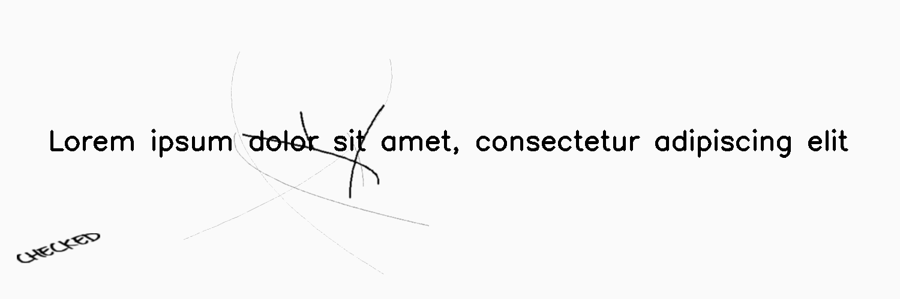

*********
Scribbles
*********

.. autoclass:: augraphy.augmentations.scribbles.Scribbles
    :members:
    :undoc-members:
    :show-inheritance:

--------
Overview
--------
The Scribbles augmentation applies random scribbles to image.

Initially, a clean image with single line of text is created.

Code example:

::

    # import libraries
    import cv2
    import numpy as np
    from augraphy import *

    # create a clean image with single line of text
    image = np.full((500, 1500,3), 250, dtype="uint8")
    cv2.putText(
        image,
        "Lorem ipsum dolor sit amet, consectetur adipiscing elit",
        (80, 250),
        cv2.FONT_HERSHEY_SIMPLEX,
        1.5,
        0,
        3,
    )

    cv2.imshow("Input image", image)

Clean image:

.. figure:: augmentations/input.png

---------
Example 1
---------
In this example, a Scribbles augmentation instance is initialized and the scribbles type is set to "random", where it selects "lines" or "text" based scribbles randomly.
The scribbles_ink is set to "random", where it selects "pencil", "pen", "marker" or "highlighter" randomly.
The location of scribbles is "random" and the size of scribbles effect is set in between 400 to 600 pixels (400, 600).
Number of scribbles is set in between 1 to 6 (1,6) and the thickness of scribbles is set to random value in between 1 and 3 (1,3).
The brightness change of scribbles effect is set to select randomly from 8 and 16 [8, 16].
The color of scribbles is set to "random".
If the scribbles type is "text", the scribbles text value and font type is set to "random" where it selects randomly from the internal settings.
Additionally, the scribbles text rotate range is set to rotate randomly in any angle between 0 to 360 degree (0, 360).
If the scribbles type is "lines", the stroke count for each scribbles is set at random value in between 1 and 6 (1, 6).

Code example:

::

    scribbles = Scribbles(scribbles_type="random",
                          scribbles_ink="random",
                          scribbles_location="random",
                          scribbles_size_range=(400, 600),
                          scribbles_count_range=(1, 6),
                          scribbles_thickness_range=(1, 3),
                          scribbles_brightness_change=[8, 16],
                          scribbles_skeletonize=0,
                          scribbles_skeletonize_iterations=(2, 3),
                          scribbles_color="random",
                          scribbles_text="random",
                          scribbles_text_font="random",
                          scribbles_text_rotate_range=(0, 360),
                          scribbles_lines_stroke_count_range=(1, 6),
                          )

    img_scribbles = scribbles(image)
    cv2.imshow("scribbles", img_scribbles)

Augmented image:

