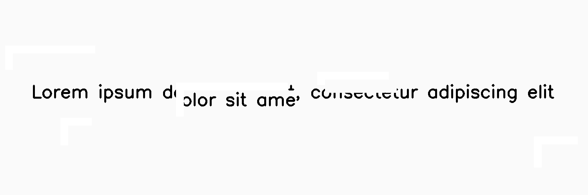

************
SectionShift
************

.. autoclass:: augraphy.augmentations.sectionshift.SectionShift
    :members:
    :undoc-members:
    :show-inheritance:

--------
Overview
--------
The SectionShift augmentation shifts single or multiple sections of image in horizontal, vertical or both directions, creating an effect of shifted image sections.

Initially, a clean image with single line of text is created.

Code example:

::

    # import libraries
    import cv2
    import numpy as np
    from augraphy import *

    # create a clean image with single line of text
    image = np.full((500, 1500,3), 250, dtype="uint8")
    cv2.putText(
        image,
        "Lorem ipsum dolor sit amet, consectetur adipiscing elit",
        (80, 250),
        cv2.FONT_HERSHEY_SIMPLEX,
        1.5,
        0,
        3,
    )

    cv2.imshow("Input image", image)

Clean image:

.. figure:: augmentations/input.png

---------
Example 1
---------
In this example, a SectionShift augmentation instance is initialized and the number of shifting sections is set to 5 (5,5).
The shifting location is set of random coordinates ("random").
The shifting value in both horizontal and vertical direction is set to 20 (20,20).
The new value in the shifted area is filled with white color (255,255,255).

Code example:

::

    sectionshift = SectionShift(section_shift_number_range = (5,5),
                                section_shift_locations = "random",
                                section_shift_x_range = (20,20),
                                section_shift_y_range = (20,20),
                                section_shift_fill_value = (255,255,255)
                                )

    img_sectionshift = sectionshift(image)
    cv2.imshow("sectionshift", img_sectionshift)

Augmented image:

