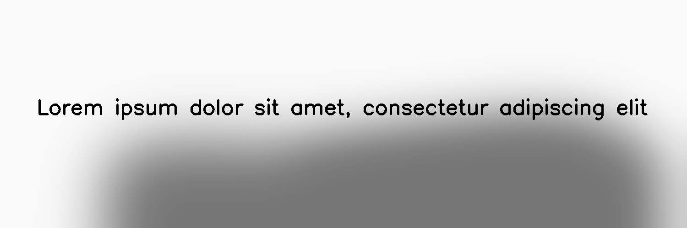

**********
ShadowCast
**********

.. autoclass:: augraphy.augmentations.shadowcast.ShadowCast
    :members:
    :undoc-members:
    :show-inheritance:

--------
Overview
--------
The ShadowCast augmentation applies random shadow effect into the image.

Initially, a clean image with single line of text is created.

Code example:

::

    # import libraries
    import cv2
    import numpy as np
    from augraphy import *

    # create a clean image with single line of text
    image = np.full((500, 1500,3), 250, dtype="uint8")
    cv2.putText(
        image,
        "Lorem ipsum dolor sit amet, consectetur adipiscing elit",
        (80, 250),
        cv2.FONT_HERSHEY_SIMPLEX,
        1.5,
        0,
        3,
    )

    cv2.imshow("Input image", image)

Clean image:

.. figure:: augmentations/input.png

---------
Example 1
---------
In this example, a ShadowCast augmentation instance is initialized and the shadow side is set to "bottom".
The shadow_vertices_range is set to any value between 2 and 3 (2,3) so that the final shadow shape is either a rectangle or pentagon.
The width and height of the shadow is set to any value between 50% to 80% (0.5, 0.8) of the image size.
The shadow color is set to black (0,0,0) and the opacity is set to any value between 50% and 60% (0.5, 0.6).
The number of stacked shadow effect is set to random value in between 1 and 2 (1,2).
The value of kernel to blur the shadow is set to a high value and the value is between 101 and 301 (101, 301). 

Code example:

::

    shadowcast = ShadowCast(shadow_side = "bottom",
                            shadow_vertices_range = (2, 3),
                            shadow_width_range=(0.5, 0.8),
                            shadow_height_range=(0.5, 0.8),
                            shadow_color = (0, 0, 0),
                            shadow_opacity_range=(0.5,0.6),
                            shadow_iterations_range = (1,2),
                            shadow_blur_kernel_range = (101, 301),
                            )

    img_shadowcast = shadowcast(image)
    cv2.imshow("shadowcast", img_shadowcast)

Augmented image:

