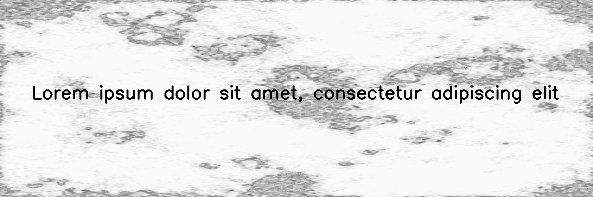

******
Stains
******

.. autoclass:: augraphy.augmentations.stains.Stains
    :members:
    :undoc-members:
    :show-inheritance:

--------
Overview
--------
The Stains augmentation creates a stains texture and the stains texture is blended into the input image by using OverlayBuilder.

Initially, a clean image with single line of text is created.

Code example:

::

    # import libraries
    import cv2
    import numpy as np
    from augraphy import *

    # create a clean image with single line of text
    image = np.full((500, 1500,3), 250, dtype="uint8")
    cv2.putText(
        image,
        "Lorem ipsum dolor sit amet, consectetur adipiscing elit",
        (80, 250),
        cv2.FONT_HERSHEY_SIMPLEX,
        1.5,
        0,
        3,
    )

    cv2.imshow("Input image", image)

Clean image:

.. figure:: augmentations/input.png

---------
Example 1
---------
In this example, a Stains augmentation instance is initialized and the stains type is set to severe stains (stains_type="severe_stains"). The method to blend stains texture into image is set to darken (stains_blend_method="darken").

Code example:

::

    stains = Stains(stains_type="severe_stains",
                    stains_blend_method="darken",
                    )

    img_stains = stains(image)

    cv2.imshow("stains", img_stains)

Augmented image:

