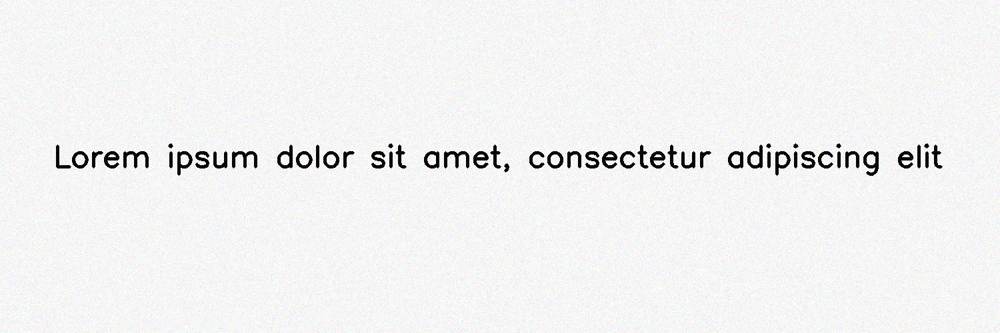

***********
SubtleNoise
***********

.. autoclass:: augraphy.augmentations.subtlenoise.SubtleNoise
    :members:
    :undoc-members:
    :show-inheritance:

--------
Overview
--------
The Subtle Noise augmentation emulates the imperfections in scanning solid colors due to subtle lighting differences.

Initially, a clean image with single line of text is created.

Code example:

::

    # import libraries
    import cv2
    import numpy as np
    from augraphy import *

    # create a clean image with single line of text
    image = np.full((500, 1500,3), 250, dtype="uint8")
    cv2.putText(
        image,
        "Lorem ipsum dolor sit amet, consectetur adipiscing elit",
        (80, 250),
        cv2.FONT_HERSHEY_SIMPLEX,
        1.5,
        0,
        3,
    )

    cv2.imshow("Input image", image)

Clean image:

.. figure:: augmentations/input.png

---------
Example 1
---------
In this example, a SubtleNoise augmentation instance is initialized and subtle range is set to 25.

Code example:

::

    subtle_noise = SubtleNoise(subtle_range=25)

    img_subtle_noise = subtle_noise(image)
    cv2.imshow("subtle_noise", img_subtle_noise)

Augmented image:

