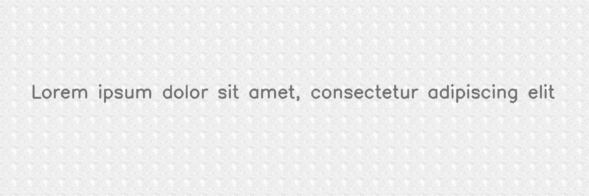
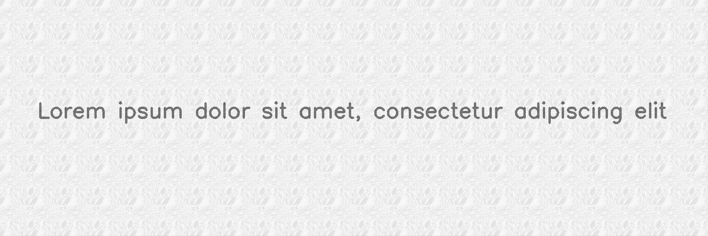
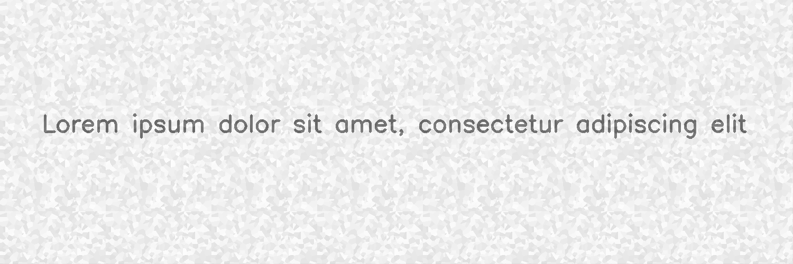

**********
VoronoiTessellation
**********

.. autoclass:: augraphy.augmentations.voronoi.VoronoiTessellation
    :members:
    :undoc-members:
    :show-inheritance:

--------
Overview
--------
The Voronoi augmentation applies Voronoi Tessellation with Perlin Noise by default, creating organic looking background patterns.
Initially, a clean image with a single line of text is created.

Code example:

::

    # import libraries
    import cv2
    import numpy as np
    from augraphy import *

    # create a clean image with single line of text
    image = np.full((500, 1500,3), 250, dtype="uint8")
    cv2.putText(
        image,
        "Lorem ipsum dolor sit amet, consectetur adipiscing elit",
        (80, 250),
        cv2.FONT_HERSHEY_SIMPLEX,
        1.5,
        0,
        3,
    )

    cv2.imshow("Input image", image)

Clean image:

.. figure:: augmentations/input.png

---------
Example 1
---------
In this example, a VoronoiTessellation instance with  with  Noise type is set to "random", if the perlin is selected (randomly) from the algorithm, a background pattern is created
and the patch is passed through the original image like a Sliding Window. The pattern background value for each randomly selected point is set to bright value (250, 256).
The number of random points generated is set in between 500 and 800. Amplification factor for Perlin Noise is set in between 50 and 80 and the seed is set to 19829813472.

Code example:

::

    voronoi_pattern = VoronoiTessellation(
                             mult_range = (50,80),
                             seed = 19829813472 ,
                             num_cells_range = (500,800),
                             noise_type = "random",
                             background_value = (200, 256)
                            )

    img_voronoi = voronoi_pattern(image)
    cv2.imshow("Voronoi Pattern", img_voronoi)

Augmented image:

`Voronoi Tessellation: width = 140. height = 140,  amplification_factor_range = 64 , seed = 19829813472, number of random points = 1975, perlin=True, background_value = (200, 256), window_size=70`

`Voronoi Tessellation: width = 200. height = 200,  amplification_factor_range = 63 , seed = 19829813472, number of random points = 733, perlin=False, background_value = (200, 256), window_size=200`
