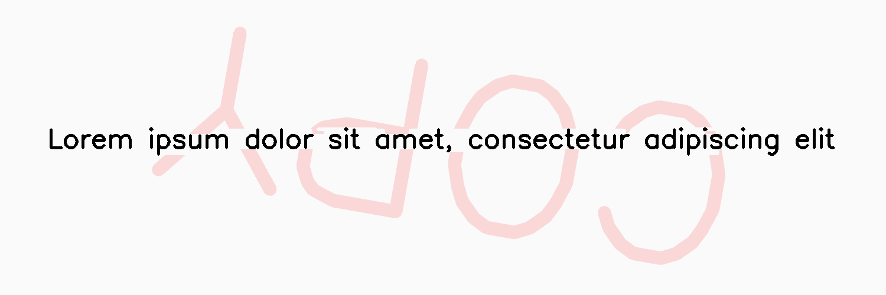

*********
WaterMark
*********

.. autoclass:: augraphy.augmentations.watermark.WaterMark
    :members:
    :undoc-members:
    :show-inheritance:

--------
Overview
--------
The WaterMark augmentation adds watermark effect into input image based on user input word, font, size and etc.

Initially, a clean image with single line of text is created.

Code example:

::

    # import libraries
    import cv2
    import numpy as np
    from augraphy import *
    
    
    # create a clean image with single line of text
    image = np.full((500, 1500,3), 250, dtype="uint8")
    cv2.putText(
        image,
        "Lorem ipsum dolor sit amet, consectetur adipiscing elit",
        (80, 250),
        cv2.FONT_HERSHEY_SIMPLEX,
        1.5,
        0,
        3,
    )
    
    cv2.imshow("Input image", image)

Clean image:

.. figure:: augmentations/input.png

---------
Example 1
---------
In this example, a WaterMark augmentation instance is initialized and the watermark word is set to random.
The watermark font size is set to random value in between 10 and 15 (10,15) and the font thickness is set in between 20 and 25 (20,25).
The watermark effect is set to rotate randomly (0,360) and the location is set to center ("center").
The watermark color is set to red (0,0,255).
Code example:

::
    watermark= WaterMark(watermark_word = "random",
                         watermark_font_size = (10,15),
                         watermark_font_thickness = (20,25),
                         watermark_font_type = cv2.FONT_HERSHEY_SIMPLEX,
                         watermark_rotation = (0,360) ,
                         watermark_location = "center",
                         watermark_color = (0,0,255),
                         watermark_method = "darken")
    
    img_watermark = watermark(image)
    cv2.imshow("watermark", img_watermark)

Augmented image:

