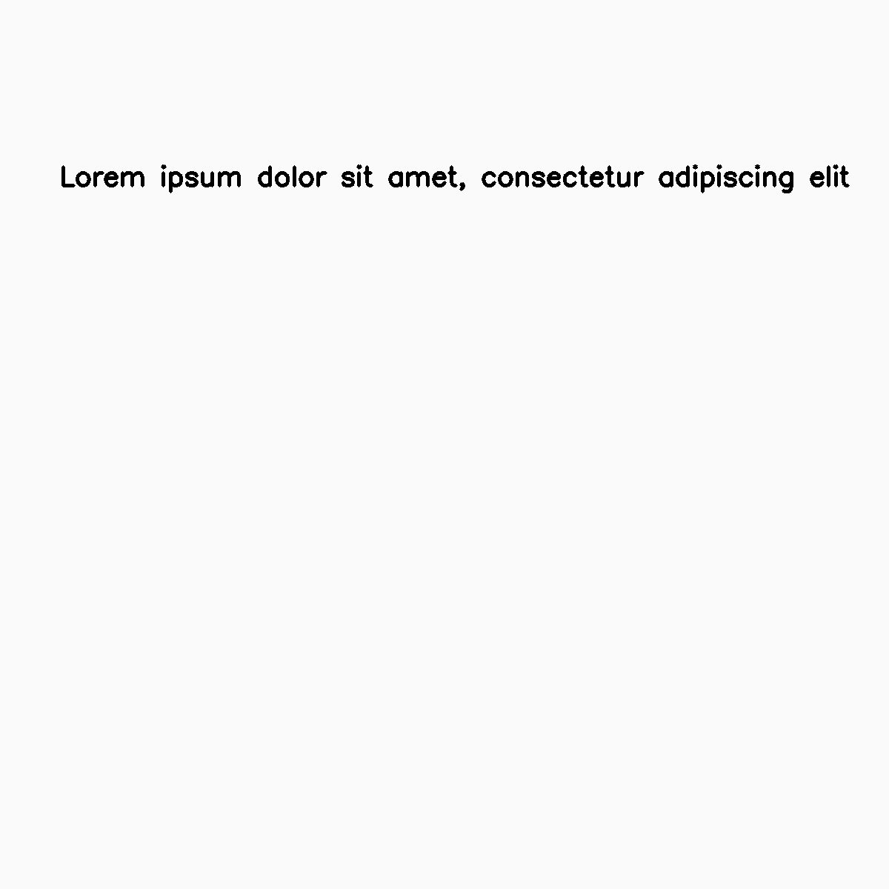
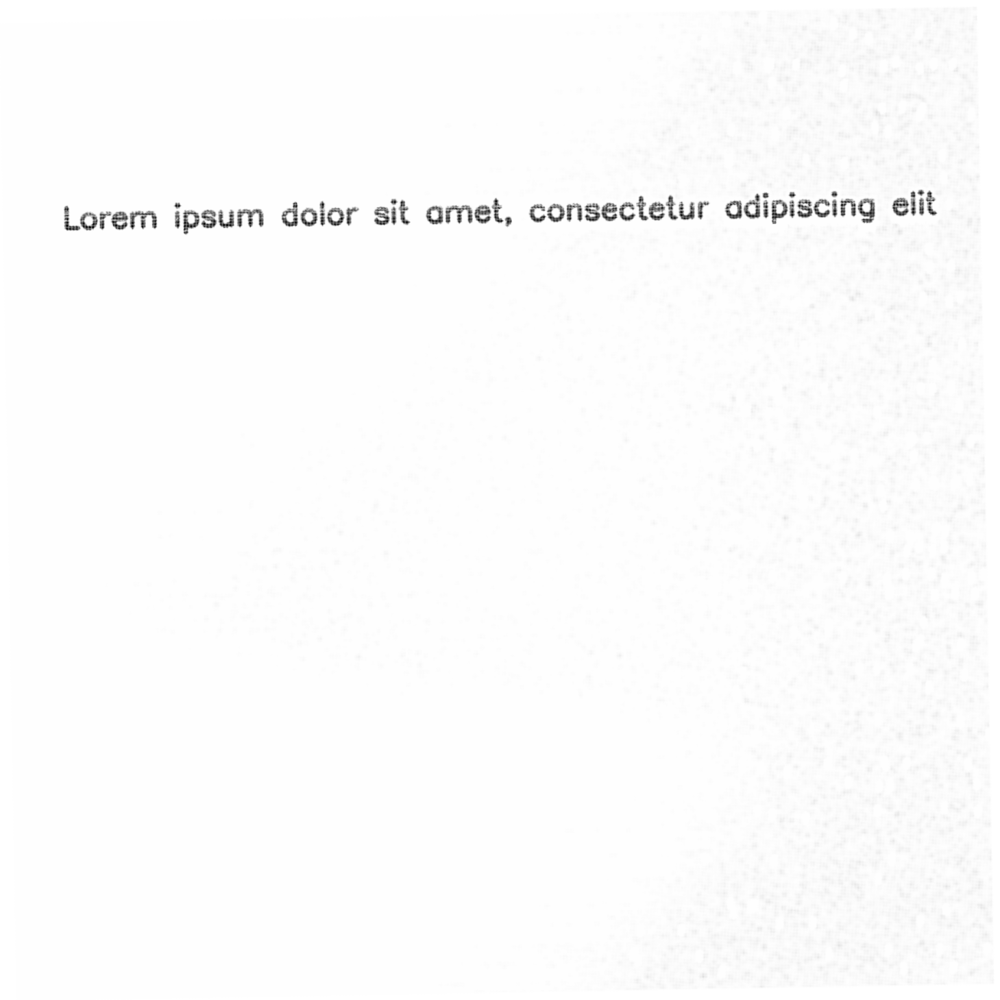
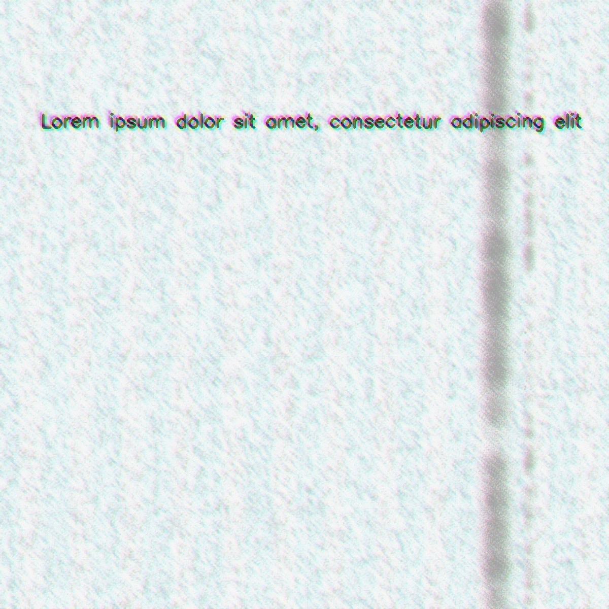

=============
Example Usage
=============

Augraphy uses pipeline in the augmentation process so an augmentation pipeline need to be initialized prior the augmentation process. The resulting output is a dictionary containing all the outputs parameters.

------------------------------------------------------------
Examples 1 : Augmentation with default augmentation pipeline
------------------------------------------------------------

To use the default pipeline which contains all available augmentations and sensible defaults::

    from augraphy import *

    pipeline = default_augraphy_pipeline()

    image = cv2.imread("image.png")

    data = pipeline(image)

    augmented = data["output"]

Input image:

Augmented image:

------------------------------------------------------------
Examples 2 : Augmentation with custom augmentation pipeline
------------------------------------------------------------

To initialize a custom augmentation pipeline and augment an image::

    from augraphy import *
    import random

    ink_phase = [

        InkBleed(
            intensity_range=(0.5, 0.6),
            kernel_size=random.choice([(5, 5), (3, 3)]),
            severity=(0.2, 0.4),
            p=0.33,
        ),
        OneOf(
            [
                InkShifter(
                    text_shift_scale_range=(18, 27),
                    text_shift_factor_range=(1, 4),
                    text_fade_range=(0, 2),
                    blur_kernel_size=(5, 5),
                    blur_sigma=0,
                    noise_type="random",
                ),
                BleedThrough(
                    intensity_range=(0.1, 0.3),
                    color_range=(32, 224),
                    ksize=(17, 17),
                    sigmaX=1,
                    alpha=random.uniform(0.1, 0.2),
                    offsets=(10, 20),
                ),
            ],
            p=1.0,
        ),
    ]

    paper_phase = [

        ColorPaper(
            hue_range=(0, 255),
            saturation_range=(10, 40),
            p=0.33,
        ),
		OneOf(
            [
                DelaunayTessellation(
                    n_points_range=(500, 800),
                    n_horizontal_points_range=(500, 800),
                    n_vertical_points_range=(500, 800),
                    noise_type="random",
                    color_list="default",
                    color_list_alternate="default",
                ),
                PatternGenerator(
                    imgx=random.randint(256, 512),
                    imgy=random.randint(256, 512),
                    n_rotation_range=(10, 15),
                    color="random",
                    alpha_range=(0.25, 0.5),
                ),
                VoronoiTessellation(
                    mult_range=(50, 80),
                    seed=19829813472,
                    num_cells_range=(500, 1000),
                    noise_type="random",
                    background_value=(200, 255),
                ),
            ],
            p=1.0,
        ),
        AugmentationSequence(
            [
                NoiseTexturize(
                    sigma_range=(3, 10),
                    turbulence_range=(2, 5),
                ),
                BrightnessTexturize(
                    texturize_range=(0.9, 0.99),
                    deviation=0.03,
                ),
            ],
        ),
    ]

    post_phase = [
        OneOf(
            [
                DirtyDrum(
                    line_width_range=(1, 6),
                    line_concentration=random.uniform(0.05, 0.15),
                    direction=random.randint(0, 2),
                    noise_intensity=random.uniform(0.6, 0.95),
                    noise_value=(64, 224),
                    ksize=random.choice([(3, 3), (5, 5), (7, 7)]),
                    sigmaX=0,
                    p=0.2,
                ),
                DirtyRollers(
                    line_width_range=(2, 32),
                    scanline_type=0,
                ),
            ],
            p=1.0,
        ),
        SubtleNoise(
            subtle_range=random.randint(5, 10),
            p=0.33,
        ),
        Jpeg(
            quality_range=(25, 95),
            p=0.33,
        ),

        OneOf(
            [
                Markup(
                    num_lines_range=(2, 7),
                    markup_length_range=(0.5, 1),
                    markup_thickness_range=(1, 2),
                    markup_type=random.choice(["strikethrough", "crossed", "highlight", "underline"]),
                    markup_color="random",
                    single_word_mode=False,
                    repetitions=1,
                ),
                Scribbles(
                    scribbles_type="random",
                    scribbles_location="random",
                    scribbles_size_range=(250, 600),
                    scribbles_count_range=(1, 6),
                    scribbles_thickness_range=(1, 3),
                    scribbles_brightness_change=[32, 64, 128],
                    scribbles_text="random",
                    scribbles_text_font="random",
                    scribbles_text_rotate_range=(0, 360),
                    scribbles_lines_stroke_count_range=(1, 6),
                ),
            ],
            p=1.0,
        ),
		OneOf(
            [
                GlitchEffect(
                    glitch_direction="random",
                    glitch_number_range=(8, 16),
                    glitch_size_range=(5, 50),
                    glitch_offset_range=(10, 50),
                ),
                ColorShift(
                    color_shift_offset_x_range=(3, 5),
                    color_shift_offset_y_range=(3, 5),
                    color_shift_iterations=(2, 3),
                    color_shift_brightness_range=(0.9, 1.1),
                    color_shift_gaussian_kernel_range=(3, 3),
                ),
            ],
            p=1.0,
        ),
        BadPhotoCopy(
            mask=None,
            noise_type=-1,
            noise_side="random",
            noise_iteration=(1, 2),
            noise_size=(1, 3),
            noise_value=(128, 196),
            noise_sparsity=(0.3, 0.6),
            noise_concentration=(0.1, 0.6),
            blur_noise=random.choice([True, False]),
            blur_noise_kernel=random.choice([(3, 3), (5, 5), (7, 7)]),
            wave_pattern=random.choice([True, False]),
            edge_effect=random.choice([True, False]),
            p=0.33,
        ),

		Faxify(
            scale_range=(0.3, 0.6),
            monochrome=random.choice([0, 1]),
            monochrome_method="random",
            monochrome_arguments={},
            halftone=random.choice([0, 1]),
            invert=1,
            half_kernel_size=random.choice([(1, 1), (2, 2)]),
            angle=(0, 360),
            sigma=(1, 3),
            p=0.33,
        ),
    ]

    pipeline = AugraphyPipeline(ink_phase=ink_phase, paper_phase=paper_phase, post_phase=post_phase)

    image = cv2.imread("image.png")

    image_augmented = pipeline(image)

Input image:

Augmented image:

