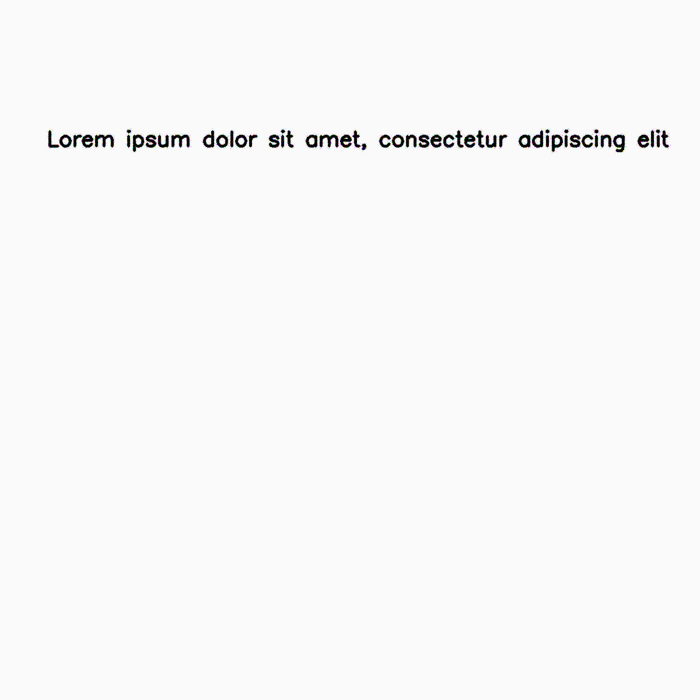
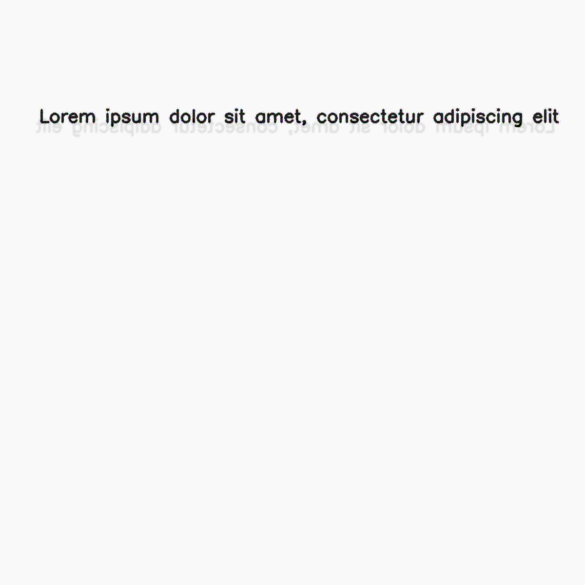
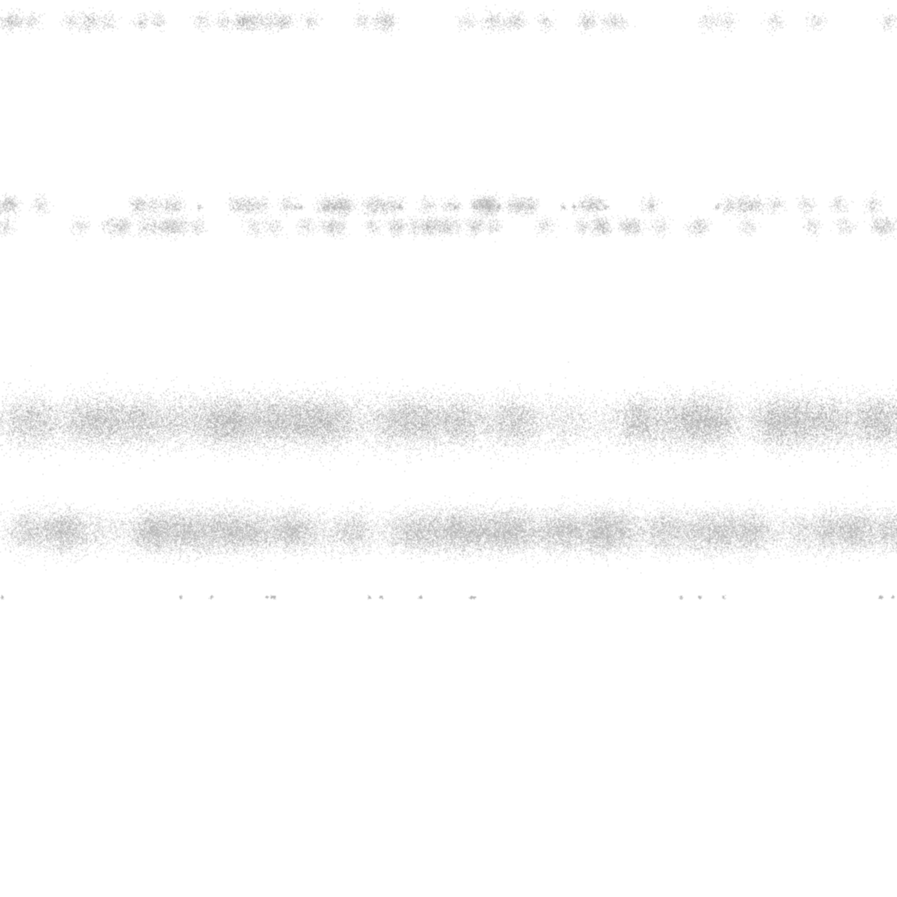
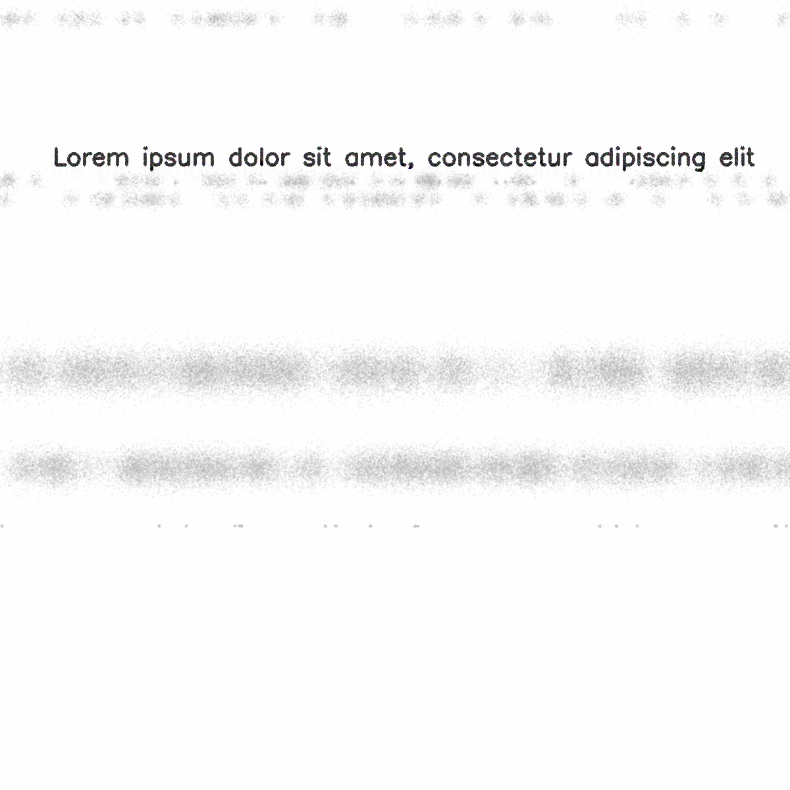
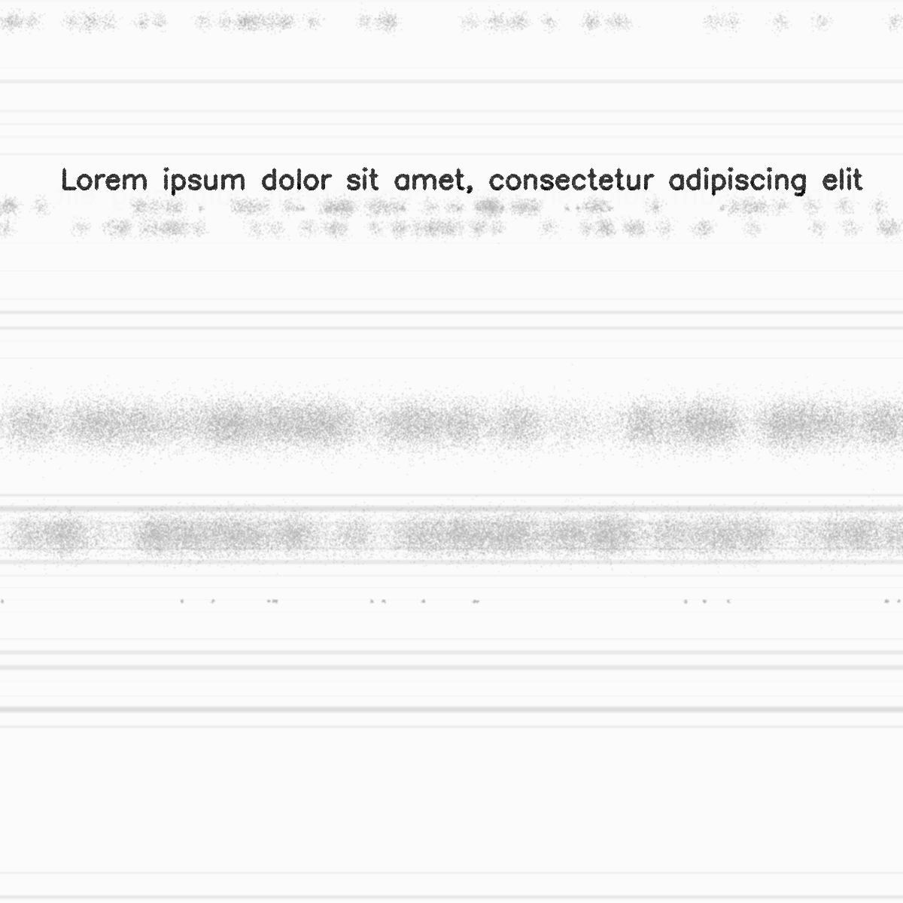
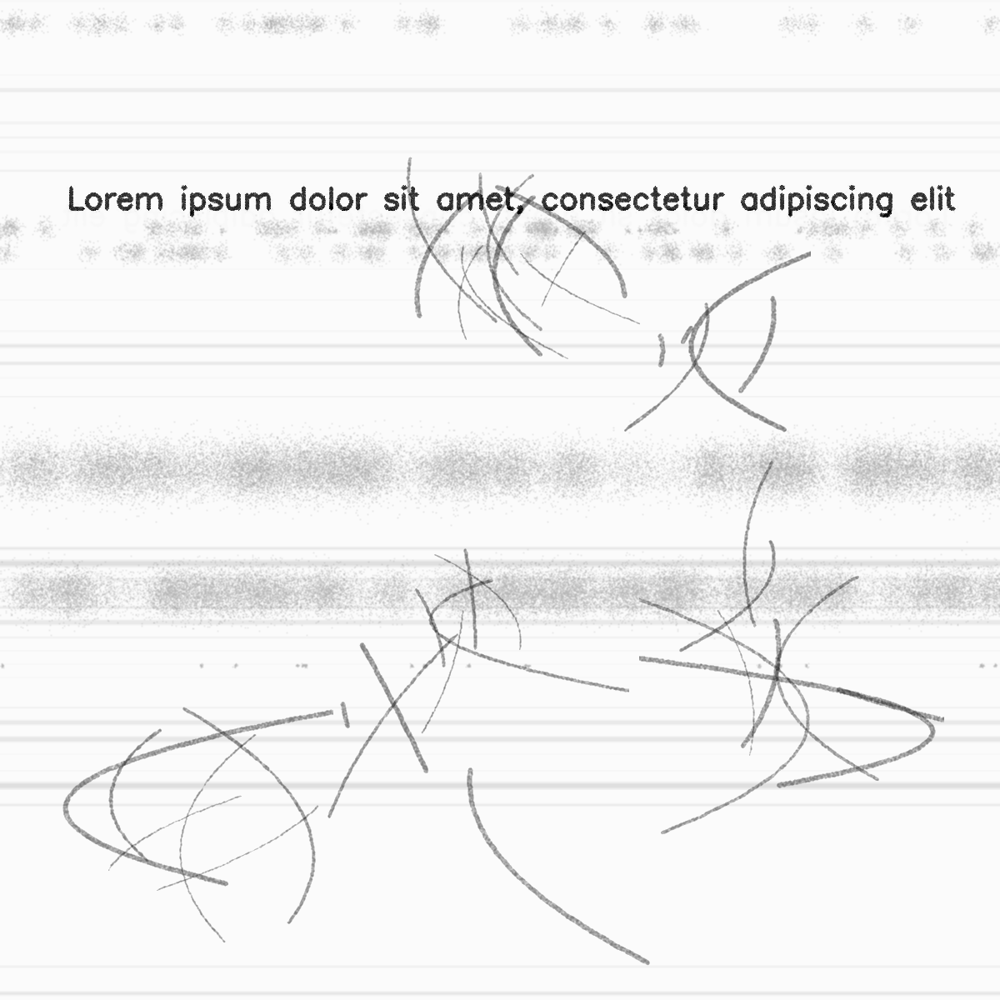

****************
AugraphyPipeline
****************

.. autoclass:: augraphy.base.augmentationpipeline.AugraphyPipeline
    :members:
    :undoc-members:
    :show-inheritance:

--------
Overview
--------
AugraphyPipeline is the core utility function to enable user create an augmentation pipeline. It contains 3 phases, where each of them are ink phase, paper phase and post phase. Ink phase and paper phase augmentations will be applied first and their output will be merged and become the input for post phase augmentations.

-------------------------------
Example to use AugraphyPipeline
-------------------------------
This is an example to use AugraphyPipeline in the augmentation, and both of the flag to save logs and save output images are set to true::

    # import libraries
    from augraphy import *
    import cv2
    import numpy as np

    ink_phase   = [InkBleed(p=0.7),
                   BleedThrough(p=0.7)]
    paper_phase = [WaterMark(p=0.7),
                   DirtyDrum(p=0.7)]
    post_phase  = [DirtyRollers(p=0.7),
                   PencilScribbles(p=0.7)]
    pipeline    = AugraphyPipeline(ink_phase, paper_phase, post_phase, log=True, save_outputs=True)

    image = np.full((1200, 1200,3), 250, dtype="uint8")
    cv2.putText(
        image,
        "Lorem ipsum dolor sit amet, consectetur adipiscing elit",
        (80, 250),
        cv2.FONT_HERSHEY_SIMPLEX,
        1.2,
        0,
        3,
    )

    augmented_image = pipeline.augment(image)["output"]

Input image:

.. figure:: input/input.png

Augmented image:

.. figure:: augmentationpipeline/output.png

Setting the "log" flag to true enable the logging feature.
A folder in a same file level with name of "logs" will be created and a log file will be created, each of the log file name is initialized in the format of "log_(year)_(month)_(day)_(hour)_(minute)_(second).txt".
In the log file, each new line records details from an augmentation and they are in the format of "augmentation name, status, augmentation parameters".
Augmentation name shows the name of augmentation, while status shows True when augmentation is completed successfuly and False when it is not (when probability < assigned value).
Augmentation parameters will be displayed only if augmentation is completed successfuly and it shows a dictionary of augmentation parameters.

An example of log file contents::

    InkBleed,True,{'p': 0.7, 'intensity_range': [0.1, 0.2], 'color_range': [0, 224], 'kernel_size': [5, 5], 'severity': [0.4, 0.6]}

    BleedThrough,True,{'p': 0.7, 'intensity_range': [0.1, 0.9], 'color_range': [0, 224], 'ksize': [17, 17], 'sigmaX': 1, 'alpha': (), 'offsets': [20, 20]}

    WaterMark,False,

    DirtyDrum,True,{'p': 0.7, 'line_width_range': [1, 4], 'line_concentration': 0.1, 'direction': 0, 'noise_intensity': 0.5, 'noise_value': [0, 30], 'ksize': [3, 3], 'sigmaX': 0}

    DirtyRollers,True,{'p': 0.7, 'line_width_range': [8, 12], 'scanline_type': 0}

    PencilScribbles,True,{'p': 0.7, 'size_range': [250, 400], 'count_range': [1, 10], 'stroke_count_range': [1, 6], 'thickness_range': [2, 6], 'brightness_change': 128}

Setting the "save_outputs" flag enables the feature to save images in each stage of the augmentation pipeline.
A folder in a same file level with name of "augmentation_images" will be created. This folder contains another 3 sub-folders, each with name of "ink", "paper", "post" to store on each phase's augmentation images.
Each image name is in the format of "(index in total images)_(phase)(image index in current phase)_(augmentation name)".

Example on augmented images in each phase:

Ink Phase:

Ink layer input

.. figure:: augmentationpipeline/augmentation_images/ink/p0_ink0_ink_layer_input.png

After InkBleed augmentation

After BleedThrough augmentation

Paper Phase:

Paper layer input

After DirtyDrum augmentation

Post Phase:

Post layer input (Merged from Ink layer output and Paper layer output)

After DirtyRollers augmentation

After PencilScribbles augmentation

