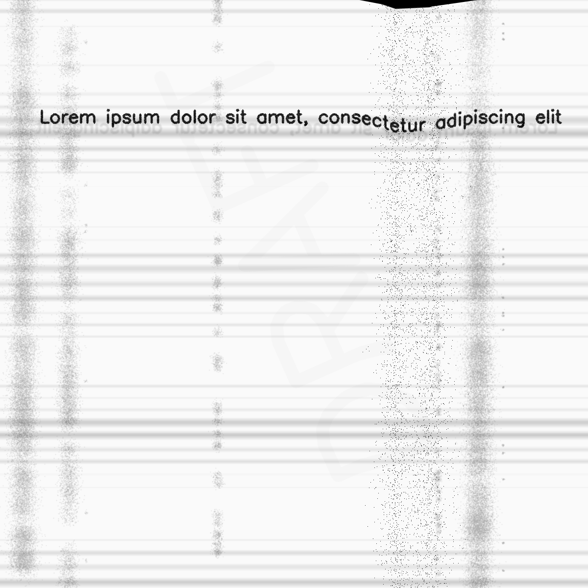

********************
AugmentationSequence
********************

.. autoclass:: augraphy.base.augmentationsequence.AugmentationSequence
    :members:
    :undoc-members:
    :show-inheritance:

--------
Overview
--------
AugmentationSequence allows augmentation pipeline to apply several augmentations sequentially.

-------
Example
-------
In this example, AugmentationSequence function is use to apply two augmentations seqentially in ink phase of the augmentation pipeline.
In post phase, two AugmentationSequence are nested inside another AugmentationSequence to apply a series of augmentations sequentially.::

    # import libraries
    from augraphy import *
    import cv2
    import numpy as np

    # initialize phases and pipeline
    # ink phase with single AugmentationSequence usage
    ink_phase   = [
                   AugmentationSequence([

                    InkBleed(p=1),
                    WaterMark(p=1)

                   ],p=1)
            ]

    paper_phase = []

    # post phase with two nested AugmentationSequence inside another AugmentationSequence
    post_phase  = [
                   AugmentationSequence([

                            AugmentationSequence([
                            BleedThrough(p=1),
                            DirtyDrum(p=1)
                            ],p=1),

                            AugmentationSequence([
                            Folding(p=1),
                            DirtyRollers(p=1)
                            ],p=1)

                    ],p=1)
            ]

    # initialize pipeline
    pipeline    = AugraphyPipeline(ink_phase, paper_phase, post_phase)

    # create input image
    image = np.full((1200, 1200,3), 250, dtype="uint8")
    cv2.putText(
        image,
        "Lorem ipsum dolor sit amet, consectetur adipiscing elit",
        (80, 250),
        cv2.FONT_HERSHEY_SIMPLEX,
        1.2,
        0,
        3,
    )

    # augment image
    augmented_image = pipeline.augment(image)["output"]

Input image:

.. figure:: input/input.png

Augmented image:

