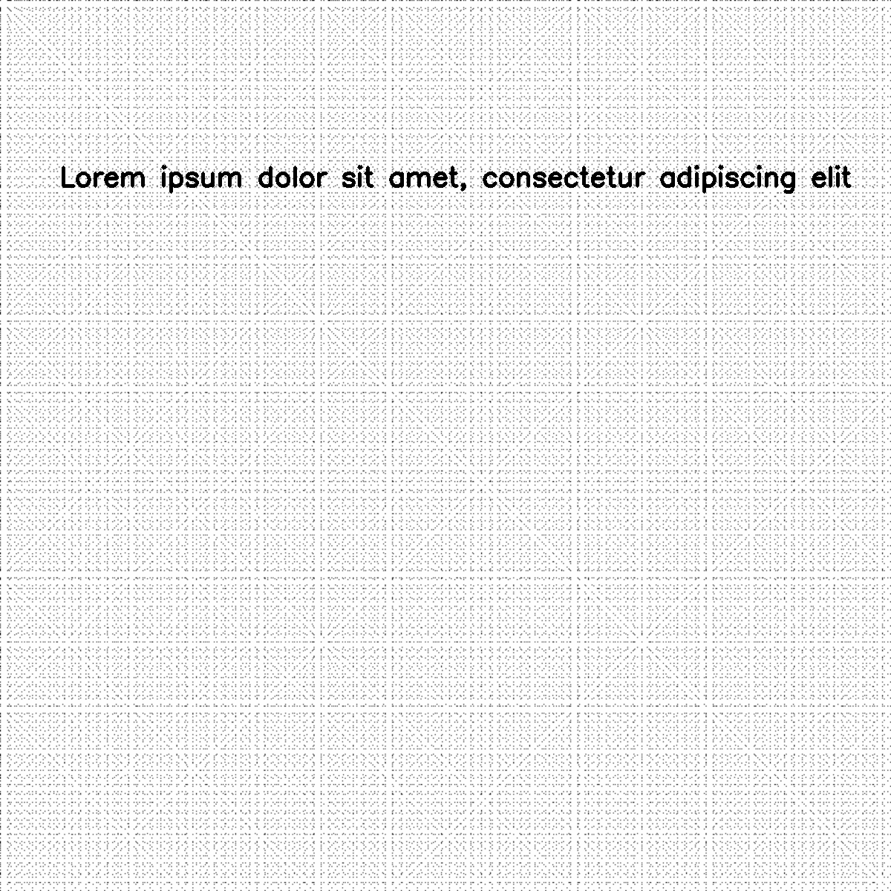

************
PaperFactory
************

.. autoclass:: augraphy.base.paperfactory.PaperFactory
    :members:
    :undoc-members:
    :show-inheritance:

--------
Overview
--------
PaperFactory is an augmentation specific to paper phase of the augmnentation pipeline.
It applies texture into image based on a random image chosen from the provided directory.

-------
Example
-------
In this example, PaperFactory is use to apply texture extracted from an image in the chosen texture image directory into an input image.
::

    # import libraries
    from augraphy import *
    import cv2
    import numpy as np
    import os

    # create directory for paper texture
    paper_texture_dir = os.path.join(os.getcwd(), "paper_textures/")
    os.makedirs(paper_texture_dir, exist_ok = True)

    # create an empty image
    image_texture = np.full((1000,1000), fill_value=255, dtype="uint8")

    # create texture
    for i in range(5):
        i += 8
        image_texture[::i,::i] = 0

    # save texture image in the paper texture directory
    cv2.imwrite(paper_texture_dir+"texture.png", image_texture)

    ink_phase   = []
    paper_phase = [PaperFactory(texture_path=paper_texture_dir, p=1)]
    post_phase  = []
    pipeline    = AugraphyPipeline(ink_phase, paper_phase, post_phase)

    image = np.full((1200, 1200,3), 250, dtype="uint8")
    cv2.putText(
        image,
        "Lorem ipsum dolor sit amet, consectetur adipiscing elit",
        (80, 250),
        cv2.FONT_HERSHEY_SIMPLEX,
        1.2,
        0,
        3,
    )

    augmented_image = pipeline.augment(image)["output"]

Input image:

.. figure:: input/input.png

Texture image:

Augmented image:

