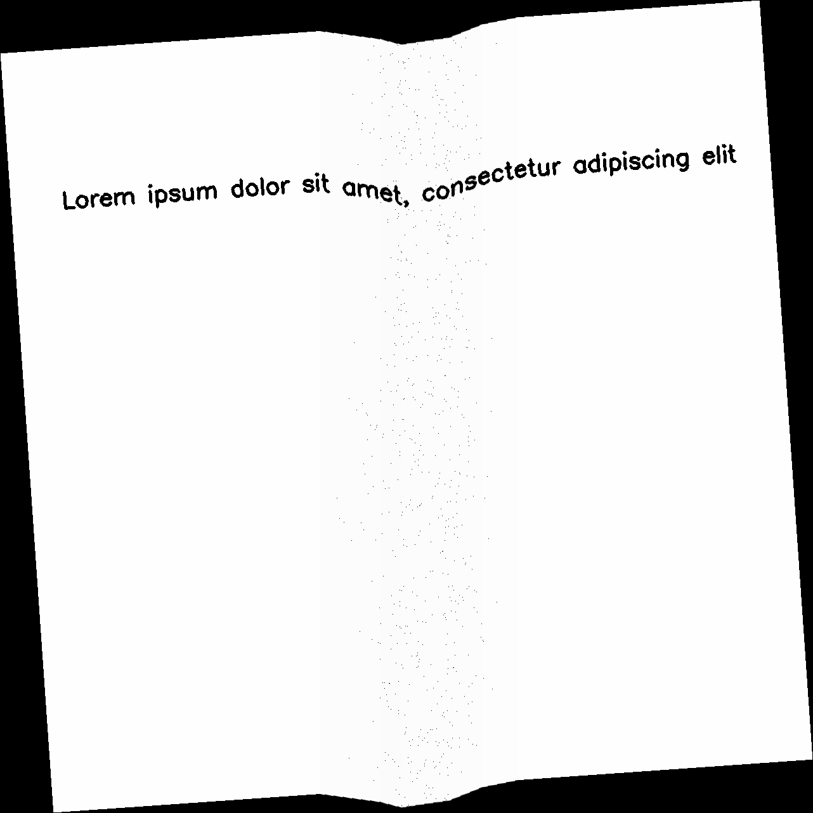
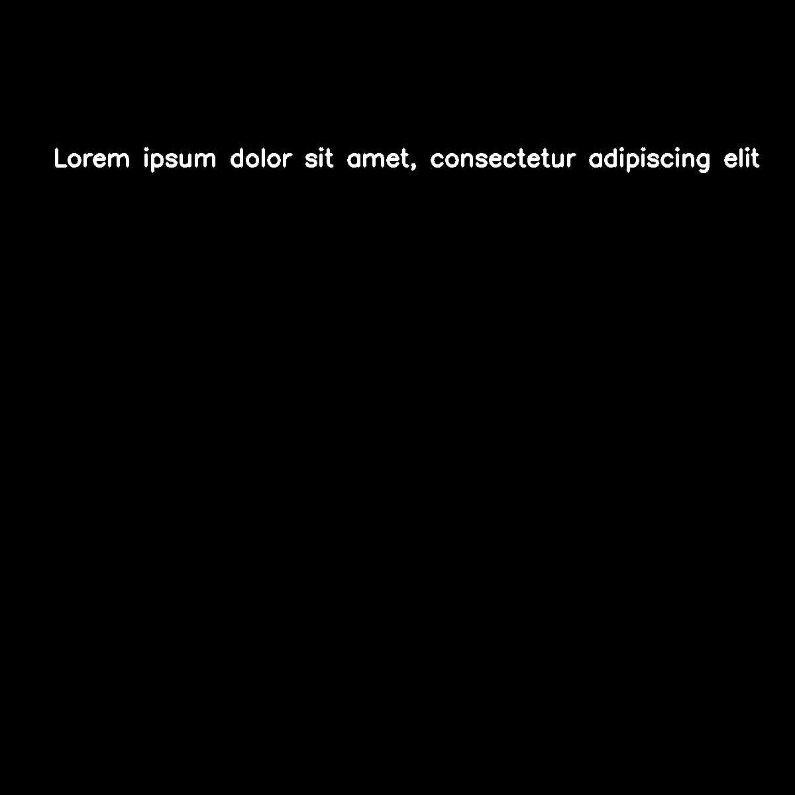
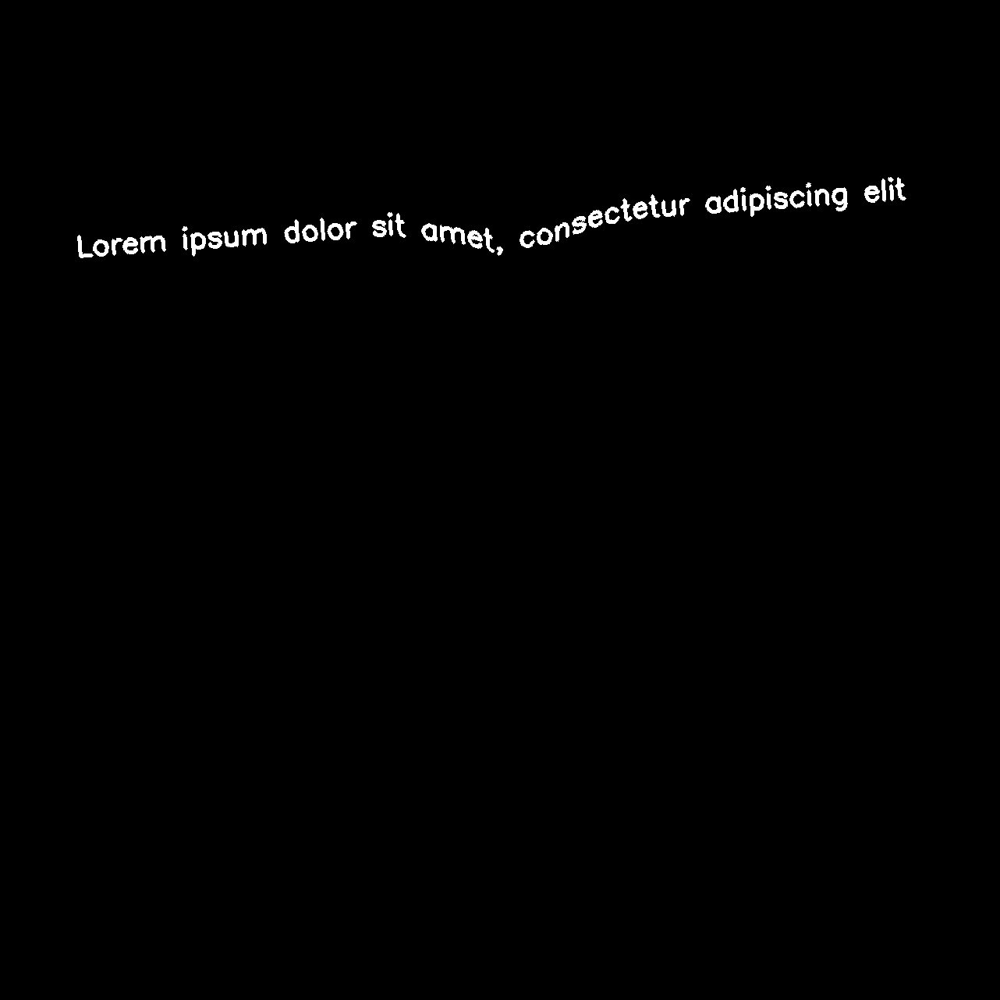
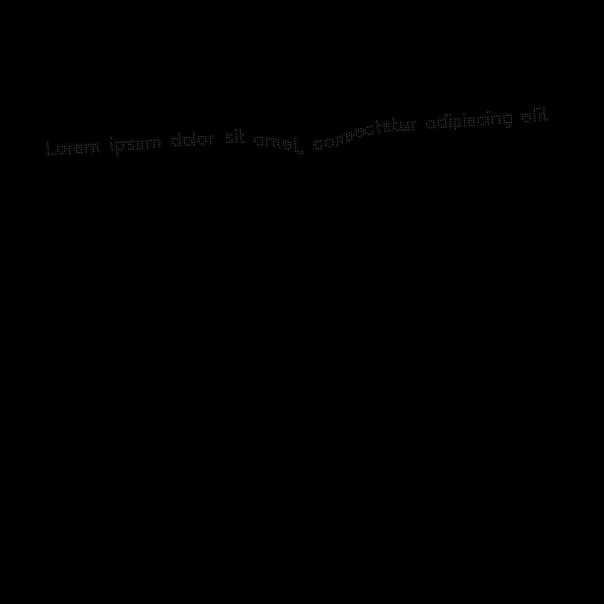
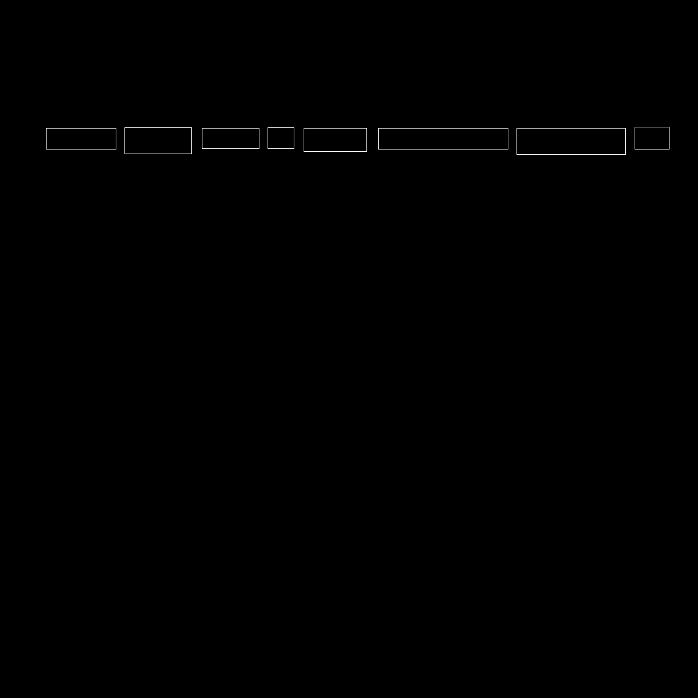
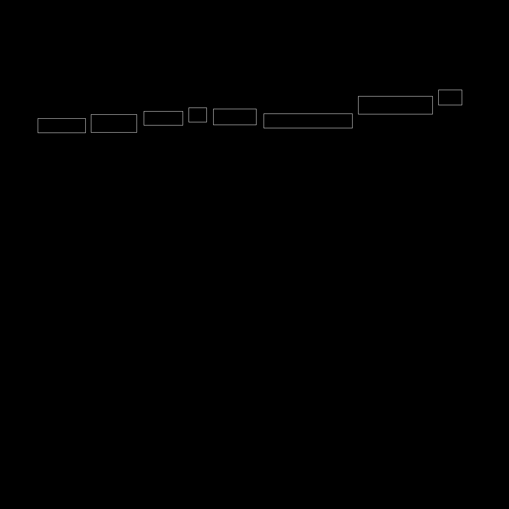

==================
How Augraphy Works
==================

Augraphy uses a pipeline in augmentation process. Augraphy's augmentation pipeline starts with an image of a clean document.  The pipeline begins by extracting the text and graphics from the source into an "ink" layer.  (Ink is synonymous with toner within Augraphy.)  The augmentation pipeline then distorts and degrades the ink layer.

A paper factory provides either a white page or a randomly-selected paper texture base.  Like the ink layer, the paper can also be processed through a pipeline to further provide random realistic paper textures.

After both the ink and paper phases are completed, processing continues by applying the ink, with its desired effects, to the paper.  This merged document image is then augmented further with distortions such as adding folds or other physical deformations or distortions that rely on simultaneous interactions of paper and ink layers.

The end result is an image that mimics real documents.

.. figure:: ../../images/Pipeline.png

--------------------------
Example of simple pipeline
--------------------------

An example of simple augmentation pipeline with just single augmentation in each ink, paper and post phase.

::

    from augraphy import *
    import cv2
    import numpy as np

    ink_phase   = [InkShifter]
    paper_phase = [VoronoiTessellation(p=1)]
    post_phase  = [GlitchEffect]
    pipeline    = AugraphyPipeline(ink_phase=ink_phase, paper_phase=paper_phase, post_phase=post_phase)

    image = np.full((1200, 1200,3), 250, dtype="uint8")
    cv2.putText(
        image,
        "Lorem ipsum dolor sit amet, consectetur adipiscing elit",
        (80, 250),
        cv2.FONT_HERSHEY_SIMPLEX,
        1.2,
        0,
        3,
    )

    augmented_image = pipeline(image)

    cv2.imshow("input image", image)
    cv2.imshow("augmented",augmented_image)

Input image:

.. figure:: how_augraphy_works_examples/input.png

Augmented image:

.. figure:: how_augraphy_works_examples/simple.png

---------------------------
Example of complex pipeline
---------------------------

The current augmentation pipeline is a complex pipeline with multiple augmentations in each of the ink, paper and post phase.

::

    import random
    from augraphy import *
    import cv2
    import numpy as np

    ink_phase = [
        Dithering(
            dither=random.choice(["ordered", "floyd-steinberg"]),
            order=(3, 5),
            p=0.33,
        ),
        InkBleed(
            intensity_range=(0.5, 0.6),
            kernel_size=random.choice([(5, 5), (3, 3)]),
            severity=(0.3, 0.4),
            p=0.33,
        ),
        BleedThrough(
            intensity_range=(0.1, 0.3),
            color_range=(32, 224),
            ksize=(17, 17),
            sigmaX=1,
            alpha=random.uniform(0.1, 0.2),
            offsets=(10, 20),
            p=0.33,
        ),
        Letterpress(
            n_samples=(100, 400),
            n_clusters=(200, 400),
            std_range=(500, 3000),
            value_range=(150, 224),
            value_threshold_range=(96, 128),
            blur=1,
            p=0.33,
        ),
        OneOf(
            [
                LowInkRandomLines(
                    count_range=(5, 10),
                    use_consistent_lines=random.choice([True, False]),
                    noise_probability=0.1,
                ),
                LowInkPeriodicLines(
                    count_range=(2, 5),
                    period_range=(16, 32),
                    use_consistent_lines=random.choice([True, False]),
                    noise_probability=0.1,
                ),
            ],
        ),
    ]

    paper_phase = [
        PaperFactory(p=0.33),
        ColorPaper(
            hue_range=(0, 255),
            saturation_range=(10, 40),
            p=0.33,
        ),
        WaterMark(
            watermark_word="random",
            watermark_font_size=(10, 15),
            watermark_font_thickness=(20, 25),
            watermark_rotation=(0, 360),
            watermark_location="random",
            watermark_color="random",
            watermark_method="darken",
            p=0.33,
        ),
        OneOf(
            [
                AugmentationSequence(
                    [
                        NoiseTexturize(
                            sigma_range=(3, 10),
                            turbulence_range=(2, 5),
                        ),
                        BrightnessTexturize(
                            texturize_range=(0.9, 0.99),
                            deviation=0.03,
                        ),
                    ],
                ),
                AugmentationSequence(
                    [
                        BrightnessTexturize(
                            texturize_range=(0.9, 0.99),
                            deviation=0.03,
                        ),
                        NoiseTexturize(
                            sigma_range=(3, 10),
                            turbulence_range=(2, 5),
                        ),
                    ],
                ),
            ],
            p=0.33,
        ),
        Brightness(
            brightness_range=(0.9, 1.1),
            min_brightness=0,
            min_brightness_value=(120, 150),
            p=0.1,
        ),
    ]

    post_phase = [
        OneOf(
            [
                PageBorder(
                    page_border_width_height="random",
                    page_border_color=(0, 0, 0),
                    page_border_background_color=(0, 0, 0),
                    page_numbers="random",
		    page_rotation_angle_range=(0, 0),
                    curve_frequency=(2, 8),
                    curve_height=(2, 4),
                    curve_length_one_side=(50, 100),
                    same_page_border=random.choice([0, 1]),
                ),
                DirtyRollers(
                    line_width_range=(2, 32),
                    scanline_type=0,
                ),
            ],
            p=0.33,
        ),
        OneOf(
            [
                LightingGradient(
                    light_position=None,
                    direction=None,
                    max_brightness=255,
                    min_brightness=0,
                    mode="gaussian",
                    linear_decay_rate=None,
                    transparency=None,
                ),
                Brightness(
                    brightness_range=(0.9, 1.1),
                    min_brightness=0,
                    min_brightness_value=(120, 150),
                ),
            ],
            p=0.33,
        ),
        DirtyDrum(
            line_width_range=(1, 6),
            line_concentration=random.uniform(0.05, 0.15),
            direction=random.randint(0, 2),
            noise_intensity=random.uniform(0.6, 0.95),
            noise_value=(64, 224),
            ksize=random.choice([(3, 3), (5, 5), (7, 7)]),
            sigmaX=0,
            p=0.33,
        ),
        SubtleNoise(
            subtle_range=random.randint(5, 10),
            p=0.33,
        ),
        Jpeg(
            quality_range=(25, 95),
            p=0.33,
        ),
        Folding(
            fold_x=None,
            fold_deviation=(0, 0),
            fold_count=random.randint(1, 6),
            fold_noise=random.uniform(0, 0.2),
            gradient_width=(0.1, 0.2),
            gradient_height=(0.01, 0.02),
            p=0.33,
        ),
        Markup(
            num_lines_range=(2, 7),
            markup_length_range=(0.5, 1),
            markup_thickness_range=(1, 2),
            markup_type=random.choice(["strikethrough", "crossed", "highlight", "underline"]),
            markup_color="random",
            single_word_mode=False,
            repetitions=1,
            p=0.33,
        ),
        Scribbles(
            scribbles_type="lines",
            scribbles_ink="random",
            scribbles_location="random",
            scribbles_size_range=(400, 600),
            scribbles_count_range=(1, 6),
            scribbles_thickness_range=(1, 3),
            scribbles_brightness_change=[32, 64, 128],
            scribbles_skeletonize=0,
            scribbles_skeletonize_iterations=(2, 3),
            scribbles_color="random",
            scribbles_lines_stroke_count_range=(1, 2),
            p=0.33,
        ),
        BadPhotoCopy(
            mask=None,
            noise_type=-1,
            noise_side="random",
            noise_iteration=(1, 2),
            noise_size=(1, 3),
            noise_value=(128, 196),
            noise_sparsity=(0.3, 0.6),
            noise_concentration=(0.1, 0.6),
            blur_noise=random.choice([True, False]),
            blur_noise_kernel=random.choice([(3, 3), (5, 5), (7, 7)]),
            wave_pattern=random.choice([True, False]),
            edge_effect=random.choice([True, False]),
            p=0.33,
        ),
        Gamma(
            gamma_range=(0.9, 1.1),
            p=0.33,
        ),
        BindingsAndFasteners(
            overlay_types="darken",
            foreground=None,
            effect_type="random",
            ntimes=(2, 6),
            nscales=(0.9, 1.0),
            edge="random",
            edge_offset=(10, 50),
            use_figshare_library=0,
            p=0.33,
        ),
        Faxify(
            scale_range=(0.3, 0.6),
            monochrome=random.choice([0, 1]),
            monochrome_method="random",
            monochrome_arguments={},
            halftone=random.choice([0, 1]),
            invert=1,
            half_kernel_size=random.choice([(1, 1), (2, 2)]),
            angle=(0, 360),
            sigma=(1, 3),
            p=0.33,
        ),
    ]

    pipeline = AugraphyPipeline(ink_phase=ink_phase, paper_phase=paper_phase, post_phase=post_phase)

    cv2.imshow("input image", image)
    cv2.imshow("augmented",augmented_image)

Input image:

.. figure:: how_augraphy_works_examples/input.png

Augmented image:

.. figure:: how_augraphy_works_examples/complex.png

------------------------------------------
Example of pipeline with additional inputs
------------------------------------------

The current augmentation pipeline is a simple pipeline with additional inputs such as mask, keypoints and bounding boxes.

::

    from augraphy import *
    import cv2
    import numpy as np

    image = cv2.imread("input.png")

    # create an example of mask
    mask = np.zeros((image.shape[0], image.shape[1]), dtype="uint8")
    mask[image[:,:,0]==0] = 255

    # create an example of keypoints
    points = []
    for y in range(image.shape[0]):
        for x in range(image.shape[1]):
            if np.sum(image[y,x])<5:
                if not y%5:
                    if not x%5:
                        points += [[x, y]]
    keypoints = {"words":points}

    # create an example of bounding boxes
    bounding_boxes = [[79, 220, 199, 256],
                      [214, 219, 329, 264],
                      [347, 220, 445, 255],
                      [460, 219, 505, 255],
                      [522, 220, 630, 260],
                      [650, 220, 873, 256],
                      [888, 220, 1075, 265],
                      [1091, 218, 1150, 256]]

    # create augmentation pipeline
    ink_phase = [SectionShift()]
    paper_phase = []
    post_phase = [Geometric(rotate_range=(-5,5)),
                  Folding()]
    pipeline = AugraphyPipeline(ink_phase=ink_phase,
                                paper_phase=paper_phase,
                                post_phase=post_phase,
                                mask=mask,
                                keypoints = keypoints,
                                bounding_boxes = bounding_boxes)

    augmented_image, augmented_mask, augmented_keypoints, augmented_bounding_boxes = pipeline(image)

    # initialize input and output image for keypoints and bounding boxes
    keypoints_image = np.zeros((image.shape[0], image.shape[1]), dtype="uint8")
    bounding_boxes_image = np.zeros((image.shape[0], image.shape[1]), dtype="uint8")
    augmented_keypoints_image = np.zeros((augmented_image.shape[0], augmented_image.shape[1]), dtype="uint8")
    augmented_bounding_boxes_image = np.zeros((augmented_image.shape[0], augmented_image.shape[1]), dtype="uint8")

    # plot keypoints
    # input
    for keypoint in keypoints["words"]:
        keypoints_image[keypoint[1], keypoint[0]] = 255
    # output
    for keypoint in augmented_keypoints["words"]:
        augmented_keypoints_image[keypoint[1], keypoint[0]] = 255

    # plot bounding boxes
    # input
    for bounding_box in bounding_boxes:
        cv2.rectangle(bounding_boxes_image, (bounding_box[0],bounding_box[1]), (bounding_box[2],bounding_box[3]), color=(255,255,255), thickness=1)
    # output
    for bounding_box in augmented_bounding_boxes:
        cv2.rectangle(augmented_bounding_boxes_image, (bounding_box[0],bounding_box[1]), (bounding_box[2],bounding_box[3]), color=(255,255,255), thickness=1)

    cv2.imshow("input image", image)
    cv2.imshow("augmented",augmented_image)

    cv2.imshow("input mask", mask)
    cv2.imshow("augmented mask",augmented_mask)

    cv2.imshow("input keypoints", keypoints_image)
    cv2.imshow("augmented keypoints",augmented_keypoints_image)

    cv2.imshow("input bounding boxes", bounding_boxes_image)
    cv2.imshow("augmented bounding boxes",augmented_bounding_boxes

Input image:

.. figure:: how_augraphy_works_examples/input.png

Augmented image:

Input mask:

Augmented mask:

Input keypoints:

.. figure:: how_augraphy_works_examples/input_keypoints.png

Augmented keypoints:

Input bounding boxes:

Augmented bounding boxes:

