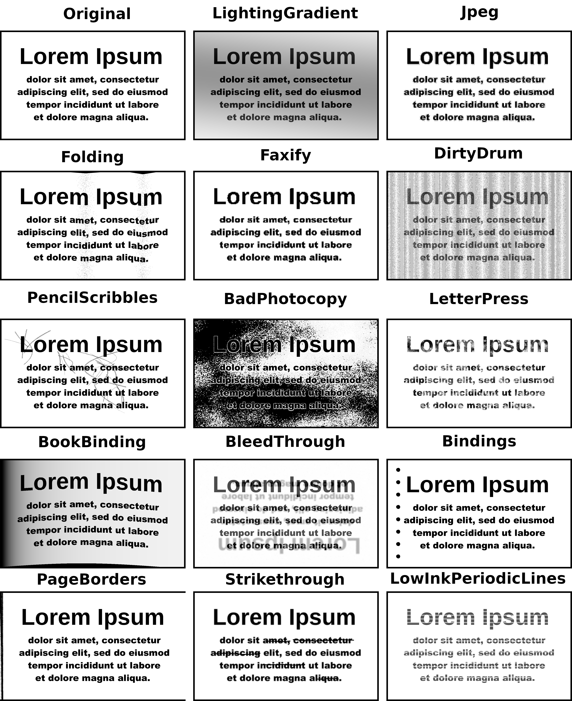

Augraphy
========

.. figure:: images/logo/augraphy.png

Augraphy is a Python library that creates multiple copies of original documents though an augmentation pipeline that randomly distorts each copy -- degrading the clean version into dirty and realistic copies rendered through synthetic paper printing, faxing, scanning and copy machine processes.

Highly-configurable pipelines apply adjustments to the originals to create realistic old or noisy documents by acting as a factory, producing almost an infinite number of variations from their source.  This simulation of realistic paper-oriented process distortions can create large amounts of training data for AI/ML processes to learn how to remove those distortions.

Treatments applied by Augraphy fabricate realistic documents that appear to have been printed on dirty laser or inkjet printers, scanned by dirty office scanners, faxed by low-resolution fax machines and otherwise mistreated by real-world paper handling office equipment.

:Example Before / After Images:

.. toctree::
   :maxdepth: 1
   :caption: Contents:

   doc/source/installation
   doc/source/how_augraphy_works
   doc/source/example_usage
   doc/source/list_of_augmentations
   doc/source/deep_learning_frameworks_integration
   doc/source/helper_and_utilities
